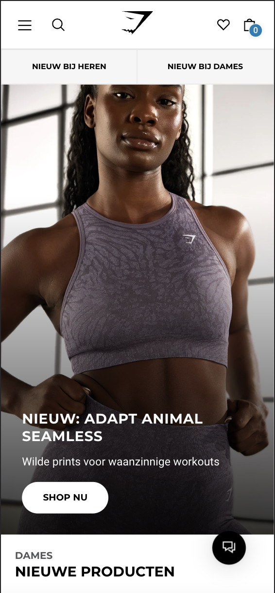
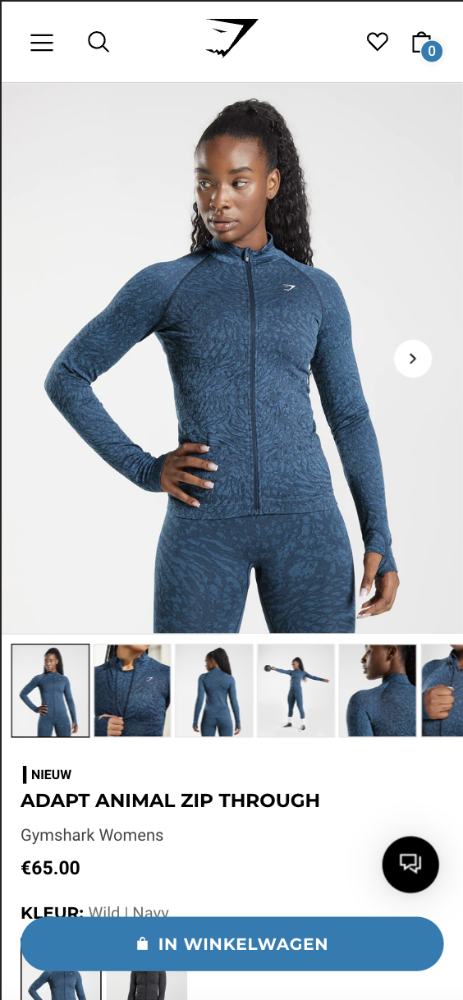
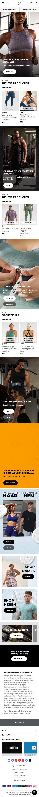
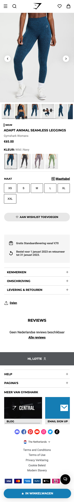
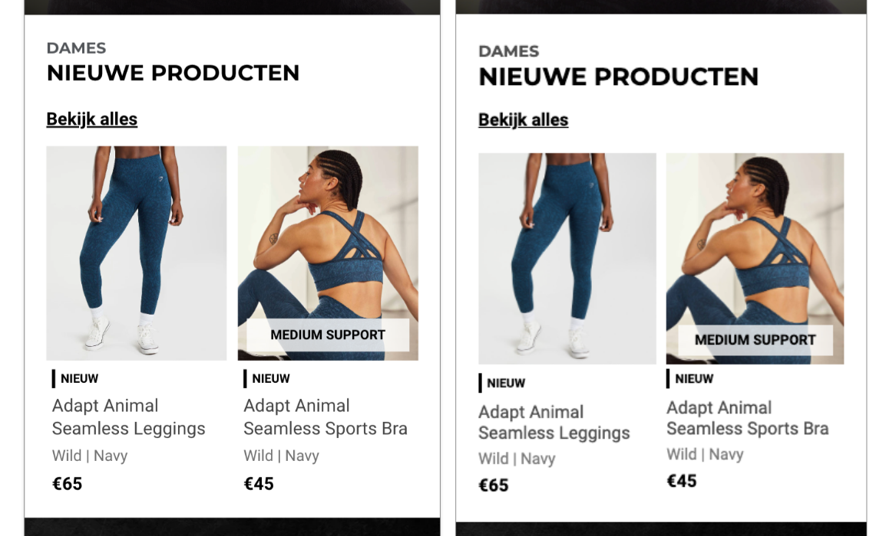
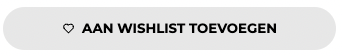
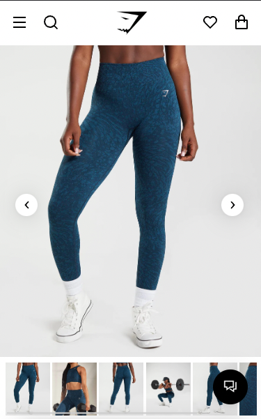

# Procesverslag
Markdown is een simpele manier om HTML te schrijven.  
Markdown cheat cheet: [Hulp bij het schrijven van Markdown](https://github.com/adam-p/markdown-here/wiki/Markdown-Cheatsheet).

Nb. De standaardstructuur en de spartaanse opmaak van de README.md zijn helemaal prima. Het gaat om de inhoud van je procesverslag. Besteedt de tijd voor pracht en praal aan je website.

Nb. Door *open* toe te voegen aan een *details* element kun je deze standaard open zetten. Fijn om dat steeds voor de relevante stuk(ken) te doen.

## Jij

  
uitwerken voor kick-off werkgroep

  ### Auteur:
  Lotte Veerman

  #### Je startniveau:
  Blauw

  #### Je focus:
  Surface plane
 

## Je website

  
uitwerken voor kick-off werkgroep

  ### Je opdracht:
  https://nl.gymshark.com/
  
  #### Screenshot(s) van de eerste pagina (small screen): 
  Homepage 
  

  #### Screenshot(s) van de tweede pagina (small screen):
  Detailpagina 
  
  
 

## Toegankelijkheidstest 1/2 (week 1)

  
uitwerken na test in 1e werkgroep

  ### Bevindingen
  Op de huidige website werkt de screenreader best wel prima. Het enige wat niet helemaal goed ging waren de headings. Die slaat de screenreader over. En je kan bijvoorbeeld het menu niet overslaan dus die wordt eerst helemaal opgenoemd voordat je de rest van de website kan bekijken.

  #### Screenreader
  Ik zou kunnen kijken naar de kopjes. Ik heb geen idee of het lukt maar het zou fijn zijn als die kopjes in mijn website wel worden opgenoemd.

  #### Muis en Toetsenbord 
  Met de tabs kun je door de hele website heen zonder je muis te hoeven gebruiken. Wanneer je op een knop wil klikken kan dat met enter.

  #### Motoriek (shocks, elastiekjes)
  Deze test hebben we in week 1 niet gedaan.

  #### Visueel (brillen, contrast, kleurenblind, dark/light). 
  Deze test hebben we in week 1 niet gedaan.

## Breakdownschets (week 1)

  
uitwerken na afloop 2e werkgroep

  ### de hele pagina: 
  

## Voortgang 1 (week 2)

  
uitwerken voor 1e voortgang

  ### Stand van zaken
  Ik was ziek tijdens de eerste voortgang dus ik was er niet bij. Hierdoor heb ik geen feedback ontvangen.

## Voortgang 2 (week 3)

  
uitwerken voor 2e voortgang

  ### Stand van zaken
  Deze keer was ik er wel bij. Ik heb mijn website laten zien hoever ik tot nu toe ben. Op dat moment had ik de eerste pagina bijna klaar behalve de footer en het menu. Dit werkte nog niet. Er werden wat vragen gesteld over keuzes die ik had gemaakt bijvoorbeeld over hoe ik de carroussel had gemaakt. Dit was gelukig allemaal goed.

  ### Verslag van meeting
  Ik vroeg mij tijdens de voortgang 1 ding af en dat was hoe ik een deel van de footer moest maken. Ik was daar al aan begonnen maar dat lukte niet helemaal. In de footer zit een stukje dat je in en uit kan klappen en wanneer de dat doet veranderd het icoon van een plus naar een min. De docent vertelde dat ik dit het beste met details kon maken dus dat heb ik opgezocht.

## Toegankelijkheidstest 2/2 (week 4)

  
uitwerken na test in 8e werkgroep

  ### Bevindingen
  Het testen van de toegankelijkheid ging eigenlijk heel goed. Sommige dingen waren wat lastiger maar over het algemeen ben ik wel tevreden met het eindresultaat. 

  #### Screenreader
  Mijn website reageert niet op tabs. Wanneer ik de screenreader aanzet gaat hij alles in een keer opnoemen wat niet gaat natuurlijk. Wel vraagt hij bij elke knop of je daarop wil klikken. Dat is wel goed gegaan. Ook slaat de screenreader alle headings over. 

  Ik moet hier dus nog aan gaan werken om dat helemaal kloppend te krijgen. Dit heb ik ook al bij de toegankelijkheidstest in week 1 benoemnd. Het zou mooi zijn als alle heading ook worden voorgelezen

  #### Muis en Toetsenbord 
  Tijdens de screenreader heb ik ook meteen het toestenbord getest. Zoals eerder gezegd reageerd mijn website niet op tabs dus dat moet ik gaan oplossen. Ook zou het mooi zijn als de gebruiker van mijn website de vraag zou krijgen bij het menu om die over te slaan. Het menu is namelijk heel groot en dat duurt super lang tot de screenreader daar helemaal doorheen is. Ik kan goed begrijpen dat gebruikers daar niet op zitten te wachten als ze alleen de content op de homepage willen bekijken/horen.

  #### Motoriek (shocks, elastiekjes)
  Wat ik merkte bij de shocks was dat het super moeilijk was om uberhaupt je telefoon goed vast te houden. Het werd al iets makkelijker als je je telefoon in je "gewone" hand hield of als je je telefoon neerlegde op tafel. Het koste meer moeite om alles te vinden en te klikken op het menu bijvoorbeeld, daardoor duurder het allemaal ook iets langer. 

  #### Visueel (brillen, contrast, kleurenblind, dark/light). 
  Ik heb 7 verschillende brillen opgezet om te testen hoe goed je mijn website dan kan gebruiken.
  - Low contrast:
    Ik ga heel dicht op mijn scherm zitten om het beter te zien. Ook waren de du Lijntjes zijn niet te zien

  - Peripheral field loss:
    Je kan alles nog wel zien alleen lastiger en het duurt iets langer.

  - Blur/Glare:
    Je ziet niks alleen als je heel dichtbij gaat.

  - Combines loss:
    Je ziet eigenlijk alles nog maar 

  - Hemifield loss:
    Je ziet het nog wel maar soms moet je even bewegen met je hoofd om het net even iets beter te zien.

  - Color:
    Je kon alles nog wel goed zien. Alles wat blauw is wordt groen door het gele glas.

  - Central field loss:
    Website is goed te zien. Contrast is overal duidelijk. Wanneer je helemaal recht kijkt zie je eventjes niks maar wanneer je je hoofd draait wel weer goed. 

## Voortgang 3 (week 4)

  
uitwerken voor 3e voortgang

  ### Stand van zaken
  Tijdens dit voortganggesprek zijn we het beoordelingsformulier helemaal langs gegaan. Dit was erg fijn om even te zien hoe ver ik was en waar ik aankomende week nog extra op moet gaan letten.

  ### Verslag van meeting
  Als eerste ben ik even door mijn website heen gegaan om te laten zien hoe ver ik was op dat moment. Ik had ten opzichte van de week daarvoor een hoop gedaan. Het menu en de footer waren helemaal af en werkend. Ik moest nog een paar kleine dingetjes fixen op de eerste pagina en dan zou ik kunnen beginnen met de tweede pagina. 
  Wat kwam er uit het voortgang gesprek:
  - Ik moet nog even letten op de toegankelijkheid. Die klopte nog niet helemaal.
  - Ik heb vijf verschillende dingen uit de surface plane verwekt in mijn website: 
    - Animatie in menu
    - Video
    - Dom manipulatie
    - Advanced positioning
    - Toetsenbord
  - Ook moet ik mijn bronnen nog even goed opschrijven in de README.

## Eindgesprek (week 5)

  
uitwerken voor eindgesprek

  ### Je uitkomst - karakteristiek screenshots:
  
  

  ### Dit ging goed/Heb ik geleerd: 
  De opbouw van de twee pagina's ging echt super goed. Ik vond dat gedeelte ook leuk om te doen. Het positioneren van dingen en het zo hetzelfde mogelijk maken als de orginele website was een uitdaging soms maar is wel gelukt.

  Tijdens het maken van deze pagina's heb ik weer zoveel bij geleerd. Ik had al eerder gewerkt met flexbox maar niet in de mate waarin ik het nu heb gebruikt. Ik wist niet dat je dit er allemaal mee kon doen. Ook heb ik veel geleerd over Javascript. Ik heb veel geprobeerd en geexperimenteerd en ook vaak tot conclusies gekomen dat ik het moet loslaten en iets anders moet proberen. Maar dit hoort ook bij het leerproces natuurlijk. Ik heb het menu met javascript gemaakt, de tabjes in het menu, de fotogallerij en een micro animatie van de wishlist knop. 

  
  Op deze afbeelding die je het verschil tussen de echte website (links) en mijn website (rechts). Je ziet eigenlijk geen verschil en dat was leuk om te zo maken.

  
  
  Hier zie je het verschil tussen de favorieten knop wanneer je hem nog niet hebt aangeklikt en wanneer je hem wel hebt aangeklinkt. Hier zit een transision in en de source van het hartje past zich aan in je javascript.

  ### Dit was lastig/Is niet gelukt:
  Veel dingen vond ik lastig maar het moeilijkste wat ik heb gemaakt is de fotogallerij op de detailpagina. Hier kun je doormiddel van op de pijltje klikken en door de foto's zelf sliden en erop klikken navigeren naar de volgende afbeelding. Dit was een grote uitdaging met javascript. Ik heb hier heel lang aan gezeten en overal en nergens stukjes code opgezocht. Uiteindlijk is dit wel gelukt en daar ben ik wel trots op. 
  Iets wat mij niet is gelukt is het slide effect van de fotogallerij zoals dat is gemaakt op de orginele webiste. 

  Als ik meer tijd had gehad had ik nog meer micro animatie willen maken en een darkmode versie van deze website willen maken zodat de gebruiker kan kiezen. 

  
  Hierboven zie je de fotogallerij waar ik het over had. 

## Bronnenlijst

  
continu bijhouden terwijl je werkt

  Nb. Wees specifiek ('css-tricks' als bron is bijv. niet specifiek genoeg).

  1. https://www.geeksforgeeks.org/how-to-preview-image-on-click-in-gallery-view-using-html-css-and-javascript/
  Deze bron heb ik gebruikt voor het maken van de fotogallerij.  

  2. https://codepen.io/shooft/pen/BarqVdR?editors=0110
  Deze bron heb ik gebruikt voor het maken van de wishlist knop.

  3. https://codepen.io/shooft/pen/VwXXNea
  Deze bron heb ik gebruikt voor alle flexbox dingen die ik niet wist of begreep.

  4. https://www.w3schools.com/howto/tryit.asp?filename=tryhow_js_tabs
  Deze bron heb ik gebruikt voor de tabjes in mijn menu

  5. https://developer.mozilla.org/en-US/docs/Web/HTML/Element/details
  Deze bron heb ik gebruikt voor de details in mijn footer en op de detail pagina.
  
  6. bron van dlo voor het menu
  Deze bron kan ik niet meer vinden

